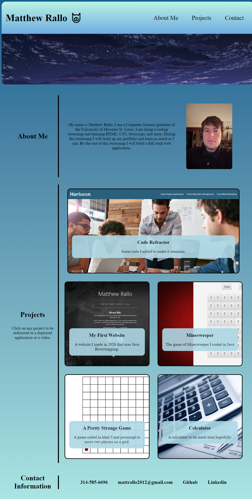

# Professional Portfolio

## Description

This is a website to showcase my skills. I coded in html and css to show some projects. Also there are links and information about me. I learned a lot about flexbox and how it works. Also I utilized pseudo selectors, media queries, and css variables. Doing this project made me a lot more comfortable with HTML and CSS.

The projects on the site are ones I actually coded. Click on a project to be redirected to a deployed application or a video. When you move cursor over projects, a glow effect happens.

##Screenshot

## License

Please refer to the LICENSE in the repo.